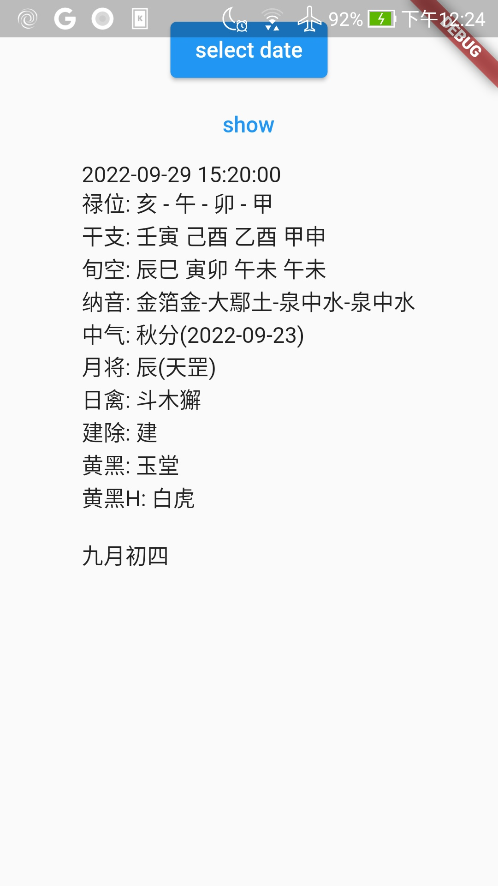

# datepicker

A new Flutter project.

## Getting Started

This project is a starting point for a Flutter application.

A few resources to get you started if this is your first Flutter project:

- [Lab: Write your first Flutter app](https://docs.flutter.dev/get-started/codelab)
- [Cookbook: Useful Flutter samples](https://docs.flutter.dev/cookbook)

For help getting started with Flutter development, view the
[online documentation](https://docs.flutter.dev/), which offers tutorials,
samples, guidance on mobile development, and a full API reference.

```bash
Flutter 3.3.0 • channel stable • ssh://git@github.com/flutter/flutter.git
Framework • revision ffccd96b62 (4 周前) • 2022-08-29 17:28:57 -0700
Engine • revision 5e9e0e0aa8
Tools • Dart 2.18.0 • DevTools 2.15.0
```


