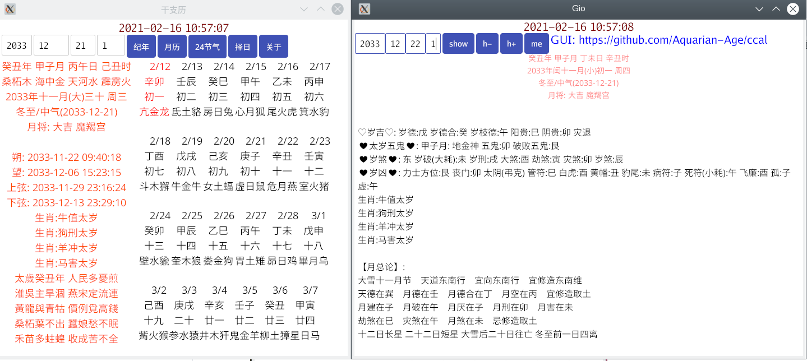
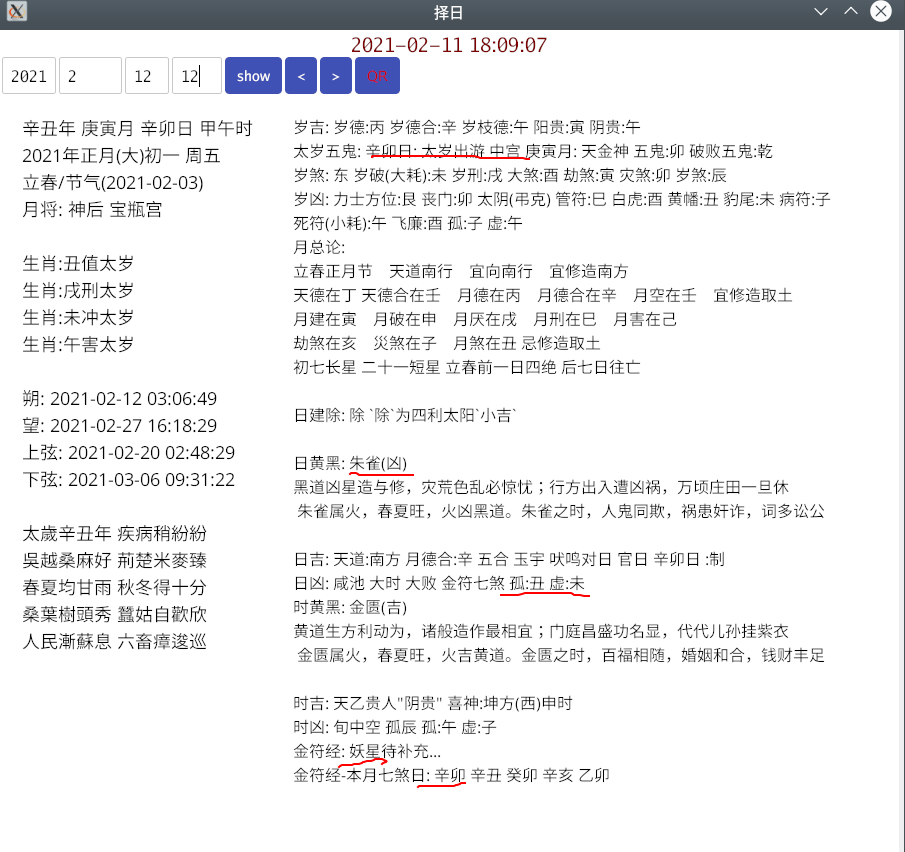
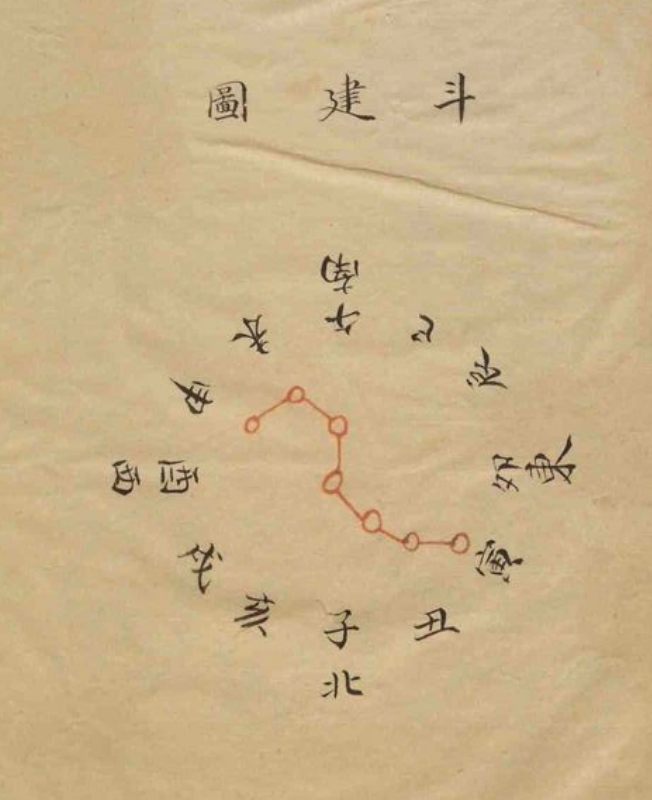

### ccal 阴阳历法 协纪辩方书择日的UI界面源码

**本软件仅适用openSUSE Tumbleweed**

- [下载](https://github.com/Aquarian-Age/ccal/releases)

### cal

---

### jdcal
一个粗略的儒略日转本地时区包 
每隔600年有30分钟时差 

###  协纪辩方书

----

### 斗建图

